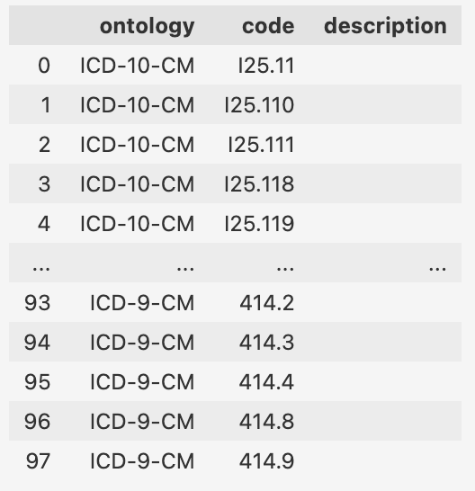

# Examples / How-To

## Overview

Let's look at how to retrieve a codelist from MedConB with Python.

The general process is:

1. Create a [`Client`][medconb_client.Client]
2. Call [`get_codelist`][medconb_client.Client.get_codelist] to retrieve a codelist by ID

You will get the Codelist as a [`Codelist`][medconb_client.Codelist] object. If you prefer pandas, you can use `codelist.codesets.toPandas()`.

## Create a Client

Usually, the MedConB API will be protected, so you need to supply a Bearer token to the requests to the API. As the way to retrieve a token can vary widely, we assume there is a function `get_token` that you can call to get a valid token.

```python
from medconb_client import Client

endpoint = "https://api.medconb.example.com/graphql/"
token = get_token()

client = Client(endpoint, token)
```

## Retrieve a Codelist by ID

To retrieve a codelist, use the [`get_codelist`][medconb_client.Client.get_codelist] method:

```python
codelist = client.get_codelist(
    codelist_id="9c4ad312-3008-4d95-9b16-6f9b21ec1ad9"
)

print(f"""
Codelist ID: {codelist.id}
Codelist Name: {codelist.name}
Codelist Description: {codelist.description}

It contains codes from the following ontologies:
{", ".join([codeset.ontology for codeset in codelist.codesets])}
""")

# Output:
# Codelist ID: 428390b8-2d78-42cf-bc2c-7175a99514c9
# Codelist Name: Coronary Artery Disease
# Codelist Description: None
#
# It contains codes from the following ontologies:
# ICD-10-CM, ICD-9-CM
```

The codelist is an object with id, name and description.

To access the codesets, use `codelist.codesets`. This is a list of [`Codeset`][medconb_client.Codeset] objects, each storing the codes from a specific ontology.

Each codeset has the attributes `ontology` and `codes`. The latter is a list of 2-tuples, where the first entry is the _code_ and the second the _description_ of the code.

!!! note

    The descriptions are empy by default and only filled when using `with_description=True` on `get_codelist`. See more below at [Retrieve descriptions of codes](#retrieve-descriptions-of-codes)

## Retrieve a Codelist from a Collection or Phenotype by name

You can also get a codelist by name. As the name is not unique in the whole workspace, you have to specify the location of the codelist by e.g. specifying the name of the collection it is in.

```python
codelist = client.get_codelist_by_name(
    codelist_name="Coronary Artery Disease",
    codelist_collection_name="Pacific AF [Sample]",
)
```

If the codelist is part of a Phenotype, use the name of the phenotype and the name of the phenotype collection:

```python
codelist = client.get_codelist_by_name(
    codelist_name="Coronary Artery Disease",
    phenotype_collection_name="[Sample] PACIFIC AF ECA",
    phenotype_name="Coronary Artery Disease",
)
```

## List all collections in your workspace

You can get an overview of your workspace by using [`client.get_workspace`][medconb_client.Client.get_workspace]. The result will be an object of [`Workspace`][medconb_client.Workspace], containing all collectons (own and shared) with stub information (id and name) on the contained codelists/phenotypes.

```python
workspace_info = client.get_workspace()

# get first collection of codelists (skip phenotypes)
collection_info = next(
    collection
    for collection in workspace_info.collections
    if collection.itemType == "Codelist"
)

codelist = client.get_codelist(collection_info.items[0].id)
```

## Search the public marketplace for codelists

The Medical Concept Builder has a marketplace where you can find all collections and phenotypes
that were made available to all users. With [`client.search_public_codelists`][medconb_client.Client.search_public_codelists]
you can search it for codelists.

```python
found_codelists = client.search_public_codelists(query="name:'blood'")
```

| query string   | description                                                        |
| -------------- | ------------------------------------------------------------------ |
| `blood`        | searches name and description for any (substring-)match of "blood" |
| `name:blood`   | searches name for any (substring-)match of "blood"                 |
| `name:'blood'` | finds "blood infusion" but not "Bloody Nose"                       |

## A codelist as a Pandas DataFrame

You can easily convert a codelist into a Pandas DataFrame with the columns "ontology", "code", "description":

```python
codelist.codesets.to_pandas()
```

<figure markdown="span">
  { width="264" }
  <figcaption>codelist as a Pandas DataFrame</figcaption>
</figure>

## Retrieve descriptions of codes

If required, you can also retrieve the descriptive text for every code in the codelist. This is only possible when using `get_codelist`.

!!! warning "Long execution time for large data retrieval"

    When you retrieve the description with the codes, the retrieval will be considerably longer.
    Be careful when you use this functionality. This is especially crucial when the codelist
    you want to retrieve is very large (>1000 codes).

To retrieve the descriptions along with the codes, pass the parameter `with_description`:

```python
codelist = client.get_codelist(codelist_id, with_description=True)
```
